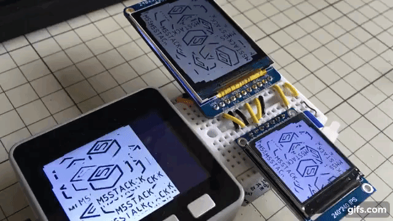

LovyanGFX LCD/e-Ink graphics driver
***********************************

LovyanGFX is an LCD driver library for ESP32 (SPI or 8bit Parallel) and ATSAMD51 (SPI). Supported devices include M5Stack, M5Core2, M5StickC, TTGO T-Watchm ODROID-GO, ESP-WROVER-KIT, WioTerminal and more...

.. image:: _static/images/demo1.gif
   :target: https://www.youtube.com/watch?v=SMOHRPqUZcQ
   :width: 49 %

.. include:: ../README.rst
   :start-after: intro-start
   :end-before:  intro-end

Among the advantages of LovyanGFX over existing libraries:

	.. include:: ../README.rst
	   :start-after: advantages-start
	   :end-before:  advantages-end

Supported environments
======================

Platforms
---------

	.. include:: ../README.rst
	   :start-after: platforms-start
	   :end-before:  platforms-end
   
Displays
--------

	.. include:: ../README.rst
	   :start-after: displays-start
	   :end-before:  displays-end

TouchScreens (only on ESP32)
----------------------------

	.. include:: ../README.rst
	   :start-after: touchscreens-start
	   :end-before:  touchscreens-end

LCD panels with similar command systems to the above compatible models might very well be supported, but only those that we have obtained and confirmed to work are officially supported.

We will give priority to the models for which we receive a support request. Please file an issue if you have a make or model display that you would like to see supported. We welcome contributions - sponsoring and code - from device manufacturers.

Active Development
==================

LovyanGFX is under active development as we write this.

This will become version 0.4.0 which implements a new API (v1). The goal for v1 remains to be mostly compatible with AdafruitGFX and TFT_eSPI. Version 0.4.0 will use API v0 by default but allow optional selection of v1 API.

In version 1.0.0, the v1 API will be the default and in version 1.1.0 support for the v0 API will be removed.

Meanwhile, we are talking to hardware manufacturers to make LovyanGFX the included display driver for their devices. Stay tuned for exciting news.
