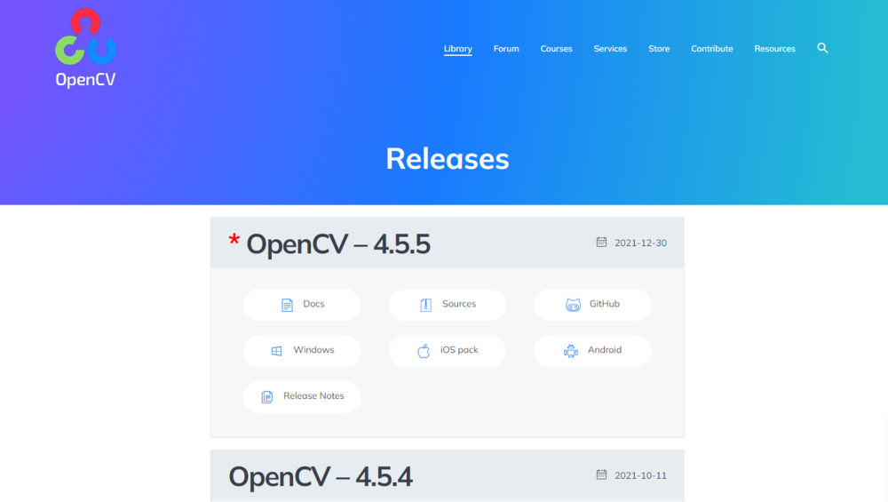
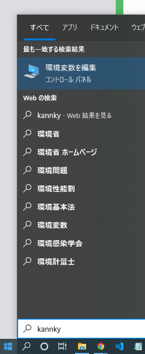
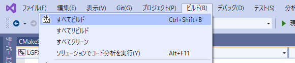
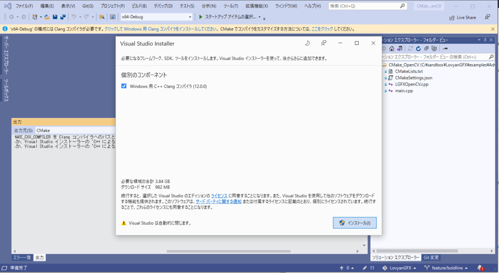

# LovyanGFX_OpenCV

## Setup

### Environment

- Windows 10
- Visual Studio 2019
- OpenCV 4.5.2

### Install

- Visual Studio 2019
  - [以前のバージョンの Visual Studio のダウンロード - 2019、2017、2015 以前のバージョン](https://visualstudio.microsoft.com/ja/vs/older-downloads/)
  - 
  -> ダウンロード
  - インストーラにて、以下を選択

    ```txt
    C++ によるデスクトップ開発
    ```

- OpenCV
  - バージョンの確認(例：4.5.2)
    - CMakeLists.txt

      ```txt
      target_link_libraries(LGFXOpenCV PUBLIC "C:/opencv/build/x64/vc15/lib/opencv_world452d.lib" )
      ```

    - opencv_worldXXXd.lib -> OpenCV X.X.Xを入れる

  - OpenCV >  Library > Releases
    - [Releases - OpenCV](https://opencv.org/releases/)
    - 入れるバージョンの Windows ボタンからダウンロード
    - 
  - インストーラを起動、C直下に作成（C:\opencvに作成される）
    - 
  - パス（環境変数）の設定
    - 環境変数の編集
      - 環境変数 > ユーザー環境変数  > "Path"を選択 > 新規
        - 
      - 以下を追加

        ```txt
        C:\opencv\build\x64\vc15\bin
        ```

    - PC再起動

### build/debug

- ビルド
  - 

- デバッグ
  - 
  - デバッグ中の様子(サンプルコード)
    - 

- デバッグの停止
  - 

### FAQ

- Windows 用 C++ Clang コンパイラがない

  ```txt
  1> CMakeSettings.json で CMakeSettings エラーが発生しました: 'x64-Debug' の選択されたツールセット環境は 'clang_cl_x64_x64' ですが、Clang コンパイラが見つかりませんでした。CMAKE_C_COMPILER と CMAKE_CXX_COMPILER を Clang コンパイラへのパスと共に指定するか、Visual Studio インストーラーの 'C++ によるデスクトップ開発' ワークロードで 'Windows 用 C++ Clang コンパイラ (12.0.0)' をインストールしてください。
  1> 'x64-Debug' の選択されたツールセット環境は 'clang_cl_x64_x64' ですが、Clang コンパイラが見つかりませんでした。CMAKE_C_COMPILER と CMAKE_CXX_COMPILER を Clang コンパイラへのパスと共に指定するか、Visual Studio インストーラーの 'C++ によるデスクトップ開発' ワークロードで 'Windows 用 C++ Clang コンパイラ (12.0.0)' をインストールしてください。
  1> 'x64-Debug' の選択されたツールセット環境は 'clang_cl_x64_x64' ですが、Clang コンパイラが見つかりませんでした。CMAKE_C_COMPILER と CMAKE_CXX_COMPILER を Clang コンパイラへのパスと共に指定するか、Visual Studio インストーラーの 'C++ によるデスクトップ開発' ワークロードで 'Windows 用 C++ Clang コンパイラ (12.0.0)' をインストールしてください。
  ```

  - 上のバーのサジェストリンクから足りないものをインストール

    - 

- opencv_worldXXX.dllが見つからないため...
  - OpenCVのバージョンが合っているかの確認、パス設定の確認をおこなう
  - ビルドエラー例

    ```txt
    重大度レベル  コード  説明  プロジェクト  ファイル  行  抑制状態
    エラー    'C:/opencv/build/x64/vc15/lib/opencv_world452d.lib', needed by 'LGFXOpenCV.exe', missing and no known rule to make it  C:\sandbox\LovyanGFX\examples\Advanced\CMake_OpenCV\out\build\x64-Debug\CMake_OpenCV  C:\sandbox\LovyanGFX\examples\Advanced\CMake_OpenCV\out\build\x64-Debug\ninja  1
    ```

  - 実行時エラー例
    - 
