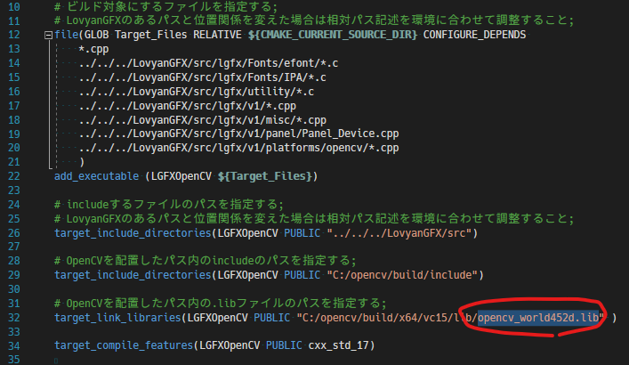
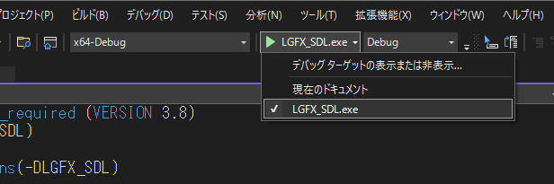

# How to build LovyanGFX for Windows.

### VisualStudio で clang を使用できるようにする

 - [VisualStudioのサイト](https://visualstudio.microsoft.com/ja/vs/)から `VisualStudio Community 2022` をダウンロード 
 - VisualStudio をインストールする際に以下のオプションを追加する
 - ` C++ によるデスクトップ開発 ` にチェックを入れる
 - 右ペインの ` インストールの詳細 ` から ` Windows用 C++ Clang ツール ` にチェックを入れる <br>


---

### SDL または OpenCV を入手し任意のフォルダに配置する
 - SDLの場合 [こちらのダウンロードページ](https://www.libsdl.org/download-2.0.php) から `Development Libraries` を入手 <br>
    
 - OpenCVの場合 [こちらのダウンロードページ](https://opencv.org/releases/) から `Releases` の `Windows` を入手 <br>
    
 - OpenCVの場合、インストーラを起動して任意の場所に展開。例ではC直下に作成 (C:\opencvに作成される) <br>
    
 - サンプルのCMakeListsは `C:\SDL2` や `C:\opencv` に配置した場合のパスを初期設定値としている

---

### 環境変数の編集を行い、パスを追加する
 - 環境変数 > ユーザー環境変数  > `Path` を選択 > 編集 > 新規
 - SDL2の場合、`C:/SDL2/lib/x64/` を追加 ( 配置した場所に合わせて調整すること )
 - OpenCVの場合、`C:/opencv/build/x64/vc15\bin` を追加 ( 配置した場所に合わせて調整すること )
 - ※ パスの場所にDLLファイルが含まれていることを確認すること
 - ※ パスを追加したあと、PCを再起動(または再ログオン)すること <br>


---

### サンプルフォルダ内のCMakeLists.txtを調整する
 - CMakeLists.txt を開き、環境に合わせてパスやファイル名の記述を調整する
 - SDL2 の場合 `examples_for_PC/CMake_SDL/CMakeLists.txt`
 - OpenCV の場合 `examples_for_PC/CMake_OpenCV/CMakeLists.txt`
 - OpenCV の場合は`.lib`ファイル名にバージョン番号が含まれているので、これも入手したバージョンと一致するよう調整する <br>


---

### VisualStudioを起動し、サンプルフォルダを開く
 - VisualStudioを起動して `ローカル フォルダーを開く` をクリックし、サンプルフォルダを選択する
 - SDL2 の場合 examples_for_PC/CMake_SDL 
 - OpenCV の場合 examples_for_PC/CMake_OpenCV <br>


 - 画面上部にあるビルドターゲットの設定枠で `LGFX_SDL` または `LGFX_OpenCV` を選択する
 - `デバッグ` > `デバッグの開始` をクリックする <br>



 - デバッグ中の様子(サンプルコード) <br>


 - デバッグの停止<br>


 - ビルド時に以下のようなエラーが出る場合や、実行時にDLLが見つからないエラーが出る場合は、環境設定のパスやCMakeLists.txtのパスおよびファイル名を見直す。環境設定後は再起動(または再ログオン)を忘れずに。

    ```txt
    重大度レベル  コード  説明  プロジェクト  ファイル  行  抑制状態
    エラー    'C:/opencv/build/x64/vc15/lib/opencv_world452d.lib', needed by 'LGFXOpenCV.exe', missing and no known rule to make it  C:\sandbox\LovyanGFX\examples\Advanced\CMake_OpenCV\out\build\x64-Debug\CMake_OpenCV  C:\sandbox\LovyanGFX\examples\Advanced\CMake_OpenCV\out\build\x64-Debug\ninja  1
    ```
  
  

